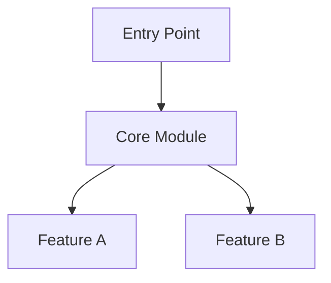

import { Callout } from 'fumadocs-ui/components/callout';

Learn how to explore repository analysis results in Offworld.

## Repository Page Layout

Every analyzed repository has a **two-column layout**:

### Left Sidebar
- Repository header (name, stars, language)
- Navigation tabs:
  - **Summary** (default)
  - **Architecture**
  - **Issues**
  - **Pull Requests**
  - **Chat**
- Quick actions (refresh, GitHub link)

### Main Content
- Tab-specific content
- Progressive loading states
- Real-time updates during analysis

## Summary Tab

The default view after navigating to a repository.

### Repository Stats

At the top:

```
facebook/react ★ 234,567
JavaScript • Last updated: 2 hours ago
```

Click the repository name to visit **GitHub**.

### AI-Generated Summary

**300-word overview** covering:

- What the repository does
- Core features and capabilities
- Main technologies used
- Target use cases

**Key characteristics**:
- No top-level H1 headings (for clean reading)
- No workflow jargon ("iteration", "consolidated")
- Natural language, not marketing copy

Example from `tanstack/router`:

> TanStack Router is a fully type-safe routing solution for React applications that prioritizes developer experience through compile-time type safety...

### Analysis Status Badge

Shows current workflow state:

| Badge | Meaning |
|-------|---------|
| **Queued** | Waiting to start |
| **Processing** | Analysis in progress |
| **Completed** | Ready to explore |
| **Failed** | Analysis error (retry available) |

<Callout type="info">
During processing, the page **auto-updates** as each step completes. No refresh needed!
</Callout>

### Architecture Diagram

**Mermaid C4 diagram** visualizing the top components:



**Features**:
- Interactive (click nodes if supported by your browser)
- Color-coded by layer (entry, core, feature)
- Includes relationships between components

**Narrative explanation** below the diagram describes:
- What each major component does
- How components relate to each other
- Overall architecture patterns

### Quick Links

- **View on GitHub** - Jump to repository
- **Refresh Analysis** - Re-index (7-day cooldown)

## Architecture Tab

Browse discovered components in detail.

### Entity List

Displays top 5-15 components ranked by importance:

```
┌─────────────────────────────────────────────┐
│ frontend/src/components          [0.85]     │
│ React component library with 50+ UI...      │
│ Layer: Core                                 │
│ [View on GitHub]                            │
└─────────────────────────────────────────────┘
```

### Entity Card Fields

**Name**: Component/package/module identifier
- Format: `path/to/component` or `package-name`
- Examples: `@tanstack/react-router`, `apps/web/src`

**Description**: 4-6 sentence explanation
- What the component does
- Key responsibilities
- Technologies used
- Integration points

**Importance Score**: 0.3-1.0 (higher = more critical)
- `1.0` - Entry points (`main.ts`, `app.tsx`)
- `0.8-0.9` - Core subsystems
- `0.5-0.7` - Features
- `0.3-0.5` - Utilities

**Layer Classification**:
- `entry-point` - Application entry
- `core` - Critical subsystems
- `feature` - Feature modules
- `utility` - Helpers
- `integration` - External integrations

**GitHub Link**: Direct link to file/directory on GitHub

### Sorting & Filtering

**Default sort**: By importance (descending)

**Planned filters** (coming soon):
- Layer type
- Importance range
- Name search

### Entity Detail Page

Click any entity name to see full details:

**URL format**: `/owner/repo/arch/entity-slug`

Example: [offworld.sh/tanstack/router/arch/tanstack-react-router](https://offworld.sh/tanstack/router/arch/tanstack-react-router)

**Detail view includes**:
- Full description (expanded)
- Related entities (coming soon)
- File tree (coming soon)
- Code snippets (coming soon)

## Understanding Importance Scores

### Entry Points (1.0)

Files that start the application:

- `src/main.ts` - Vite/Webpack entry
- `src/app.tsx` - React root
- `pages/_app.tsx` - Next.js app
- `bin/cli.js` - CLI entry

**Why important**: These orchestrate the entire application flow.

### Core Subsystems (0.7-0.9)

Critical modules that power major functionality:

- `src/auth/` - Authentication system
- `src/database/` - Data layer
- `src/router/` - Routing logic
- `packages/core/` - Core library

**Why important**: Breaking these breaks major features.

### Features (0.5-0.7)

Specific user-facing functionality:

- `src/components/` - UI components
- `src/features/chat/` - Chat feature
- `src/api/` - API endpoints

**Why important**: These deliver value but are more isolated.

### Utilities (0.3-0.5)

Helper functions and tools:

- `src/lib/utils.ts` - Utility functions
- `src/constants/` - Configuration
- `src/types/` - TypeScript types

**Why important**: Used throughout but easily replaceable.

## Progressive Updates

### During Analysis

Offworld updates the UI **in real-time** as workflow steps complete:

**Step 6 completes** → Summary appears

**Step 7-8 complete** → Entities appear one by one

**Step 9 completes** → Diagram appears

No "loading for 5 minutes" - you see results **immediately**.

### Workflow Steps

1. ✅ Validate GitHub repo
2. ✅ Fetch metadata
3. ✅ Load file tree
4. ✅ Calculate iterations
5. ✅ Ingest files to RAG
6. ✅ Generate summary → **Summary appears**
7. ✅ Discover architecture (iteration 1-N) → **Entities appear**
8. ✅ Consolidate entities
9. ✅ Generate diagrams → **Diagram appears**
10. ✅ Analyze issues
11. ✅ Analyze PRs

Check the **Convex Dashboard** → Workflows to see detailed step execution.

## Navigating Large Architectures

### Focus on Top Entities

Offworld shows only the **top 5-15 components** by importance. This prevents information overload.

If you need more granular details, use the **Chat tab** to ask:

```
"Show me all files in src/components/"
"What utilities exist in src/lib/?"
```

### Use GitHub Links

Every entity has a **direct GitHub link**. Click it to:

- Browse the actual code
- See file structure
- Check recent commits

### Ask Follow-up Questions

Use the **Chat tab** for specific queries:

```
"How does the auth module integrate with the database?"
"Show me examples of API route usage"
"What are the dependencies of the router package?"
```

## Re-Indexing

### When to Re-Index

- Repository has **significant changes** (major refactor, new architecture)
- Analysis failed and you want to retry
- RAG index is outdated (>7 days old)

### How to Re-Index

1. Go to repository summary page
2. Click **"Refresh Analysis"** button
3. Confirm re-index

<Callout type="warn">
**7-day cooldown**: You can only re-index every 7 days to prevent abuse.
</Callout>

### What Gets Cleared

Re-indexing **deletes**:

- Previous RAG embeddings (namespace cleared)
- Old architecture entities
- Issue analysis
- PR analysis

**Preserved**:
- Chat history (conversations are independent)
- Repository metadata

### Re-Index Workflow

Same 11-step workflow as initial analysis. Takes 2-5 minutes depending on repo size.

## Best Practices

### ✅ Start with Summary

Always read the **summary first** to get high-level context before diving into architecture.

### ✅ Check Importance Scores

Focus on **importance 0.7+** entities first. These are the most critical to understand.

### ✅ Follow GitHub Links

Offworld shows **AI analysis**. Always verify by reading actual code via GitHub links.

### ✅ Use Layers

**Layer classification** helps you understand component roles:
- Entry points → Start here
- Core → Critical systems
- Features → User-facing functionality
- Utilities → Helper code

### ✅ Combine with Chat

Use **architecture tab** for overview, **chat tab** for specific questions.

## Troubleshooting

### "Analysis Failed"

**Causes**:
- Repository too large (>10k files)
- GitHub API rate limit exceeded
- Invalid repository (404, private without access)
- LLM API timeout

**Solutions**:
1. Click **"Retry"** (workflow resumes from failed step)
2. Check repository exists and is public
3. Wait 5-10 minutes for rate limits to reset
4. Contact support if issue persists

### "No Entities Found"

**Causes**:
- Repository too small (&lt;5 files)
- LLM failed to discover meaningful components
- All entities filtered out (importance too low)

**Solutions**:
1. Re-index to retry
2. Use **Chat tab** to manually explore with `listFiles` tool
3. Check Convex logs for LLM validation errors

### "Diagram Not Rendering"

**Causes**:
- Invalid Mermaid syntax (LLM error)
- Browser doesn't support Mermaid rendering

**Solutions**:
1. Copy Mermaid code and paste into [mermaid.live](https://mermaid.live)
2. Read the narrative explanation instead
3. Report the issue (helps us improve prompts)

## Next Steps

- Learn about [Understanding Issues](/docs/user-guide/understanding-issues)
- Explore [Pull Requests](/docs/user-guide/pull-requests)
- Try the [Chat Interface](/docs/user-guide/chat-interface)
