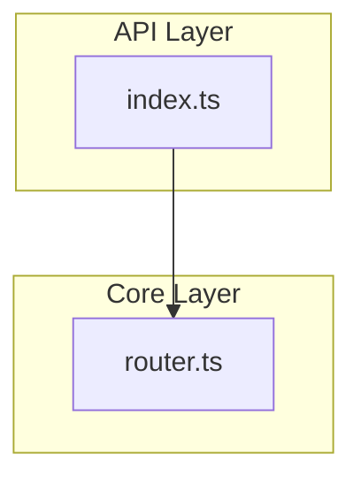
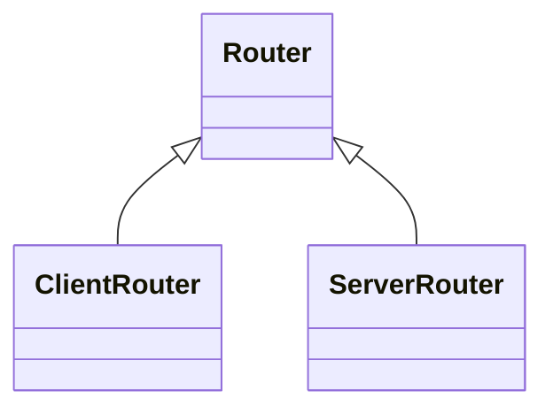

# Analysis Pipeline Overhaul

**Date:** 2026-01-14  
**Status:** Planning

---

## Problem Statement

Current skill generation pipeline produces files that are:

1. **Not user-focused** — describes internal structure, not usage patterns
2. **Missing actionable content** — no import statements, no copy-paste code
3. **Analyzing wrong content** — TanStack Router skill described the e2e test suite, not the router library
4. **Useless architecture diagrams** — file-level dependency graphs instead of conceptual architecture
5. **No API surface extraction** — missing import patterns, entry points
6. **Limited language support** — missing C, C++, Ruby, PHP

### Evidence

Generated TanStack Router SKILL.md:

```yaml
description: Comprehensive Playwright-based e2e test suite validating TanStack Router/Start features...

## When to Use
- need to add e2e tests for router features
```

This is useless. A developer says "add routing to my app" — not "need to add e2e tests."

Generated Zod architecture.md shows `vitest.root.mjs` as the only dependency node. Nobody cares.

---

## Design Decisions

1. **Progressive disclosure with 4 reference files**
   - SKILL.md = Always loaded (imports, usage, common ops)
   - references/ = On-demand (4 focused files)

2. **Two-track pipeline**
   - Deterministic Track: AST → architecture.md, api-reference.md
   - AI Track: README/examples + deterministic context → SKILL.md, summary.md, development.md
   - Deterministic files feed AI generation as context

3. **Condensed file structure (5 total files)**
   - SKILL.md: quick reference, points to references
   - architecture.md: file map + architecture + extension points (deterministic)
   - api-reference.md: import patterns, exports, signatures (deterministic)
   - summary.md: core concepts, best practices, gotchas (AI)
   - development.md: contribution guide summary (AI)

4. **Monorepo handling:** Single architecture.md with nested grouping
   - Scan for packages/*, apps/*, libs/*, etc.
   - Each package gets its own section

5. **JSDoc extraction:** Try it, remove if too complex

6. **Diagram strategy**
   - Keep Mermaid for: simplified layer diagram + inheritance class diagram
   - Remove raw import graph (too noisy)
   - Add text-based data flow

7. **Language expansion:** Add C, C++, Ruby, PHP via @ast-grep/lang-* packages

8. **Skill directory naming:** Collapse when owner == repo
   - `tanstack/query` → `tanstack-query-reference`
   - `better-auth/better-auth` → `better-auth-reference` (collapsed)
   - `zod` (local) → `zod-reference`

---

## Architecture

### Pipeline Flow

```
Current (Single Pass):
  discoverFiles → parseFile → rankFiles → buildSkeleton → AI (all content)

New (Dual Pass):
  ┌─ Deterministic Track: AST → architecture.md, api-reference.md
  └─ AI Track: README/examples + deterministic context → SKILL.md, summary.md, development.md
```

### Output Structure

```
{owner}-{repo}-reference/           # or {repo}-reference if owner == repo
├── SKILL.md                        # Always loaded: quick reference, imports, common ops
└── references/
    ├── architecture.md             # DETERMINISTIC: file map, architecture, extension points
    ├── api-reference.md            # DETERMINISTIC: import patterns, exports, signatures
    ├── summary.md                  # AI: core concepts, best practices, common gotchas
    └── development.md              # AI: summarized development/contribution guide
```

**Naming examples:**
- `tanstack/query` → `tanstack-query-reference/`
- `better-auth/better-auth` → `better-auth-reference/` (collapsed)
- `zod` (local) → `zod-reference/`

### Content Strategy

| File | Audience | Generation | Triggered By | Content |
|------|----------|------------|--------------|---------|
| **SKILL.md** | Users | AI + deterministic | Default activation | Imports, "when to use", quick start, common ops |
| **architecture.md** | Contributors | Deterministic | "how does X work", "where is Y" | File map, modules, hubs, layers, extension points |
| **api-reference.md** | Both | Deterministic | "what can I import", API lookups | Import patterns, public exports, signatures |
| **summary.md** | Users | AI | "explain", "best practices" | Core concepts, patterns, gotchas |
| **development.md** | Contributors | AI | "contribute", "develop" | Setup, testing, PR guidelines |

### Source Prioritization

**For user-facing content (AI), prioritize:**

1. README.md (especially examples, quick start)
2. Official docs/ folder
3. examples/ folder
4. Test files (for usage patterns)
5. package.json exports (for import paths)

**For contributor-facing content (deterministic + AI), prioritize:**

1. CONTRIBUTING.md
2. Source code in src/ or lib/
3. Type definitions
4. Internal docs or ADRs
5. Code comments

**Explicitly deprioritize:**

- e2e tests, benchmarks, CI configs for user content
- README marketing copy for contributor content

---

## Implementation Phases

### Phase 0: Foundation

**Goal:** Update naming logic + add language support.

#### 0.1 Update `toSkillDirName()` in `packages/sdk/src/analysis/pipeline.ts`

```typescript
function toSkillDirName(repoName: string): string {
  if (repoName.includes("/")) {
    const [owner, repo] = repoName.split("/");
    if (owner === repo) {
      return `${repo}-reference`;
    }
    return `${owner}-${repo}-reference`;
  }
  return `${repoName}-reference`;
}
```

#### 0.2 Install Language Packages

```bash
cd packages/sdk
bun add @ast-grep/lang-c @ast-grep/lang-cpp @ast-grep/lang-ruby @ast-grep/lang-php
```

#### 0.3 Update `packages/sdk/src/ast/index.ts`

Add to `LANG_MAP`:

```typescript
".c": "c",
".h": "c",
".cpp": "cpp",
".cc": "cpp",
".cxx": "cpp",
".hpp": "cpp",
".hxx": "cpp",
".rb": "ruby",
".php": "php",
```

Update `SupportedLang` type:

```typescript
export type SupportedLang = Lang | "python" | "rust" | "go" | "java" | "c" | "cpp" | "ruby" | "php";
```

Update `initLanguages()` to register new languages.

#### 0.4 Update `packages/sdk/src/ast/patterns.ts`

Add `PatternLanguage` variants: `"c" | "cpp" | "ruby" | "php"`

Add patterns:

**C:**
```typescript
c: [
  "$TYPE $NAME($$$) { $$$ }",
  "struct $NAME { $$$ }",
  "#include <$PATH>",
  '#include "$PATH"',
]
```

**C++:**
```typescript
cpp: [
  "class $NAME { $$$ }",
  "class $NAME : public $PARENT { $$$ }",
  "namespace $NAME { $$$ }",
  "$TYPE $NAME($$$) { $$$ }",
]
```

**Ruby:**
```typescript
ruby: [
  "def $NAME($$$) $$$ end",
  "class $NAME $$$ end",
  "class $NAME < $PARENT $$$ end",
  "module $NAME $$$ end",
  "require '$PATH'",
  'require "$PATH"',
]
```

**PHP:**
```typescript
php: [
  "function $NAME($$$) { $$$ }",
  "class $NAME { $$$ }",
  "class $NAME extends $PARENT { $$$ }",
  "interface $NAME { $$$ }",
  "use $PATH;",
  "require '$PATH';",
  'require "$PATH";',
]
```

#### Language Support Matrix

| Language   | Status     | Package                   | Extensions            |
| ---------- | ---------- | ------------------------- | --------------------- |
| TypeScript | ✅ Current | @ast-grep/napi (built-in) | .ts                   |
| JavaScript | ✅ Current | @ast-grep/napi (built-in) | .js, .mjs, .cjs       |
| TSX/JSX    | ✅ Current | @ast-grep/napi (built-in) | .tsx, .jsx            |
| Python     | ✅ Current | @ast-grep/lang-python     | .py                   |
| Rust       | ✅ Current | @ast-grep/lang-rust       | .rs                   |
| Go         | ✅ Current | @ast-grep/lang-go         | .go                   |
| Java       | ✅ Current | @ast-grep/lang-java       | .java                 |
| HTML, CSS  | ✅ Current | @ast-grep/napi (built-in) | .html, .css           |
| **C**      | 🆕 Adding  | @ast-grep/lang-c          | .c, .h                |
| **C++**    | 🆕 Adding  | @ast-grep/lang-cpp        | .cpp, .cc, .cxx, .hpp |
| **Ruby**   | 🆕 Adding  | @ast-grep/lang-ruby       | .rb                   |
| **PHP**    | 🆕 Adding  | @ast-grep/lang-php        | .php                  |

---

### Phase 1: Architecture.md Overhaul

**Goal:** Merge file-map into architecture.md with conceptual structure.

#### 1.1 Update `packages/sdk/src/analysis/architecture.ts`

New interface:

```typescript
export interface ArchitectureSection {
  entryPoints: EntryPoint[];
  coreModules: CoreModule[];
  hubs: HubFile[];
  layers: LayerGroup[];
  inheritance: InheritanceEdge[];
  layerDiagram: string;
  inheritanceDiagram: string;
}

export interface EntryPoint {
  name: string;
  path: string;
  exports: string[];
  exportCount: number;
}

export interface CoreModule {
  path: string;
  purpose: string;
  entryPoint: string;
  keyFiles: string[];
  hubs: string[];
}

export interface HubFile {
  path: string;
  importers: number;
  purpose: string;
}

export interface LayerGroup {
  name: string;
  files: string[];
}
```

New functions:

```typescript
export function buildArchitectureSection(
  parsedFiles: Map<string, ParsedFile>,
  graph: DependencyGraph,
  repoPath: string,
): ArchitectureSection;

export function formatArchitectureMd(section: ArchitectureSection): string;
```

#### 1.2 Logic (inspired by codemap)

1. **Detect monorepo structure:** packages/*, apps/*, libs/*
2. **Detect entry points:** index.ts, main.ts, files with most exports
3. **Mark hub files:** 3+ importers from `graph.hubs`
4. **Detect layers:** api/, core/, utils/, types/ directory patterns
5. **Infer purpose:** from directory names + export analysis
6. **Generate simplified Mermaid:** layer diagram (not raw imports)

#### 1.3 Output Format

````markdown
# Architecture

> Internal architecture reference for contributors.

## Entry Points

| Entry | Path | Exports |
|-------|------|---------|
| Main API | src/index.ts | createRouter, Route, useRouter (12 total) |
| Client | src/client/index.ts | ClientRouter (3 total) |

## Core Modules

| Module | Purpose | Entry Point | Key Files | Hubs |
|--------|---------|-------------|-----------|------|
| core/ | Routing logic | core/index.ts | router.ts, route.ts | router.ts (8←) |

## Dependency Hubs

Files imported by 3+ modules (changes have wide impact):

| File | Importers | Purpose |
|------|-----------|---------|
| core/types.ts | 12 | Core type definitions |

## Architectural Layers



## Inheritance Hierarchy



## Directory Structure

```
src/
├── index.ts          # Main entry point
├── core/
│   ├── router.ts     # Router implementation [HUB: 8←]
│   └── route.ts      # Route definitions [HUB: 5←]
└── client/
    └── index.ts      # Client-specific exports
```

## Finding Things

| Looking for... | Location |
|----------------|----------|
| Route definitions | packages/core/route.ts |
| Router implementation | packages/core/router.ts |
````

---

### Phase 2: API Surface Extraction

**Goal:** Generate `api-reference.md` with import patterns and public API.

#### 2.1 Create `packages/sdk/src/analysis/api-surface.ts`

```typescript
export interface PublicExport {
  name: string;
  path: string;
  signature: string;
  kind: "function" | "class" | "interface" | "type" | "const";
  description?: string;
}

export interface ImportPattern {
  statement: string;
  purpose: string;
  exports: string[];
}

export interface SubpathExport {
  subpath: string;
  exports: string[];
}

export interface APISurface {
  packageName: string;
  imports: ImportPattern[];
  exports: PublicExport[];
  subpaths: SubpathExport[];
}

export function extractAPISurface(
  parsedFiles: Map<string, ParsedFile>,
  packageJson?: Record<string, unknown>,
  repoPath?: string,
): APISurface;

export function formatAPISurfaceMd(surface: APISurface): string;
```

#### 2.2 Logic

1. **Read package.json:** Extract `name`, `exports`, `main`, `module`
2. **Find entry points:** From exports field or index.ts/main.ts
3. **Extract public exports:** Functions, classes, interfaces, types, consts with `export`
4. **Build import patterns:** `import { X, Y } from "package"` and subpaths
5. **Extract JSDoc descriptions:** Optional, skip if too complex

#### 2.3 Output Format

````markdown
# API Reference

> Public exports and import patterns.

## Import Patterns

```typescript
// Main entry point
import { createRouter, Route, useRouter } from "@tanstack/router";

// React-specific
import { Link, useParams } from "@tanstack/router/react";

// Server utilities
import { createServerRouter } from "@tanstack/router/server";
```

## Public Exports

| Export | Type | Signature | Description |
|--------|------|-----------|-------------|
| createRouter | function | `(opts: RouterOptions) => Router` | Create a new router instance |
| Route | class | `class Route<TPath, TParams>` | Represents a route definition |
| useRouter | function | `() => Router` | Access router in React components |

## Subpath Exports

| Subpath | Exports |
|---------|---------|
| /react | Link, useParams, useSearch, Outlet |
| /server | createServerRouter, handleRequest |

## Type Exports

| Type | Definition |
|------|------------|
| RouterOptions | `{ routes: Route[], basePath?: string }` |
| RouteParams | `Record<string, string>` |
````

---

### Phase 3: AI Integration

**Goal:** Feed deterministic files to AI for better context.

#### 3.1 Update `packages/sdk/src/analysis/prose.ts`

Add context parameter:

```typescript
export interface ProseGenerationContext {
  apiSurface: string;
  architecture: string;
  readme?: string;
  examples?: string[];
  contributing?: string;
}

export async function generateProseWithContext(
  skeleton: SkillSkeleton,
  context: ProseGenerationContext,
  options: ProseGenerationOptions,
): Promise<ProseResult>;
```

#### 3.2 Update AI Prompts

**SKILL.md prompt:**

```
You are creating a quick-reference skill for developers USING this library.

## API Surface (Deterministic - USE THESE IMPORTS)
${context.apiSurface}

## Architecture Summary
${context.architecture.slice(0, 1500)}

## README Excerpts
${context.readme?.slice(0, 2000) ?? "No README"}

YOUR TASK:
Generate SKILL.md with:
- "When to Use" triggers (5-7 natural language phrases)
- Import patterns (USE FROM API SURFACE ABOVE - DO NOT INVENT)
- Quick start code (5-10 lines)
- Common operations table (5-7 tasks)

CRITICAL: Use import statements EXACTLY as shown in API Surface.
```

**summary.md prompt:**

```
You are creating a summary for developers learning this library.

## API Surface
${context.apiSurface}

## README
${context.readme ?? "No README"}

## Examples
${context.examples?.join("\n\n") ?? "No examples"}

YOUR TASK:
Generate summary.md with:
- Overview (2-3 sentences)
- Core concepts (3-5 key ideas)
- Best practices (5-7 guidelines)
- Common gotchas (3-5 pitfalls)
```

**development.md prompt:**

```
You are creating a contributor guide.

## Architecture
${context.architecture}

## CONTRIBUTING.md
${context.contributing ?? "No CONTRIBUTING.md found"}

YOUR TASK:
Generate development.md with:
- Setup instructions (condensed)
- Testing approach
- PR guidelines
- Key code locations (from architecture)
```

#### 3.3 Update Pipeline Flow in `packages/sdk/src/analysis/pipeline.ts`

```typescript
// In runAnalysisPipeline():

// Step 1: Deterministic track (no AI)
const architectureSection = buildArchitectureSection(parsedFiles, graph, repoPath);
const architectureMd = formatArchitectureMd(architectureSection);
const apiSurface = extractAPISurface(parsedFiles, packageJson, repoPath);
const apiSurfaceMd = formatAPISurfaceMd(apiSurface);

// Step 2: Load additional context
const readmeContent = loadReadme(repoPath);
const examplesContent = loadExamples(repoPath);
const contributingContent = loadContributing(repoPath);

// Step 3: AI track (uses deterministic as context)
const proseContext: ProseGenerationContext = {
  apiSurface: apiSurfaceMd,
  architecture: architectureMd,
  readme: readmeContent,
  examples: examplesContent,
  contributing: contributingContent,
};

const proseResult = await generateProseWithContext(skeleton, proseContext, options);

// Step 4: Return all content
return {
  skill,
  graph,
  architectureGraph,
  incrementalState,
  stats,
  architectureMd,
  apiSurfaceMd,
};
```

---

### Phase 4: CLI & Installation Updates

**Goal:** Save new reference files correctly.

#### 4.1 Update `InstallSkillOptions` in `packages/sdk/src/analysis/pipeline.ts`

```typescript
export interface InstallSkillOptions {
  skillContent: string;
  summaryContent: string;
  architectureContent: string;
  apiReferenceContent: string;
  developmentContent: string;
  skillJson?: string;
  metaJson?: string;
  architectureJson?: string;
  fileIndexJson?: string;
}
```

#### 4.2 Update `installSkillWithReferences()` in `packages/sdk/src/analysis/pipeline.ts`

```typescript
export function installSkillWithReferences(repoName: string, options: InstallSkillOptions): void {
  // ... existing setup ...

  writeFileSync(join(skillDir, "SKILL.md"), options.skillContent, "utf-8");
  writeFileSync(join(refsDir, "summary.md"), options.summaryContent, "utf-8");
  writeFileSync(join(refsDir, "architecture.md"), options.architectureContent, "utf-8");
  writeFileSync(join(refsDir, "api-reference.md"), options.apiReferenceContent, "utf-8");
  writeFileSync(join(refsDir, "development.md"), options.developmentContent, "utf-8");

  // ... rest of function ...
}
```

#### 4.3 Update `apps/cli/src/handlers/generate.ts`

Pass new content to `installSkillWithReferences()`.

#### 4.4 Update `apps/cli/src/handlers/pull.ts`

Pass new content to `installSkillWithReferences()`.

---

### Phase 5: Schema & Type Updates

**Goal:** Update types to support new structure.

#### 5.1 New Types in `packages/types/src/schemas.ts`

```typescript
export const ImportPatternSchema = z.object({
  import: z.string(),
  purpose: z.string(),
});

export const TroubleshootingEntrySchema = z.object({
  symptom: z.string(),
  cause: z.string(),
  fix: z.string(),
});

export const ArchitectureConceptSchema = z.object({
  name: z.string(),
  purpose: z.string(),
  location: z.string(),
});

export const ExtensionPointSchema = z.object({
  type: z.string(),
  interface: z.string(),
  purpose: z.string(),
  example: z.string().optional(),
});

export const CodebaseMapEntrySchema = z.object({
  path: z.string(),
  purpose: z.string(),
  exports: z.array(z.string()).optional(),
});
```

#### 5.2 Extended Skill Schema

```typescript
export const SkillSchema = z.object({
  name: z.string(),
  description: z.string(),

  // User-facing
  importPatterns: z.array(ImportPatternSchema).optional(),
  whenToUse: z.array(z.string()).min(5),
  quickStartCode: z.string().optional(),
  commonOperations: z
    .array(z.object({ task: z.string(), code: z.string() }))
    .optional(),
  troubleshooting: z.array(TroubleshootingEntrySchema).optional(),

  // Contributor-facing
  architecture: z.array(ArchitectureConceptSchema).optional(),
  extensionPoints: z.array(ExtensionPointSchema).optional(),
  codebaseMap: z.array(CodebaseMapEntrySchema).optional(),

  // Existing fields
  basePaths: z.object({ repo: z.string(), analysis: z.string() }).optional(),
  quickPaths: z.array(QuickPathSchema),
  searchPatterns: z.array(SearchPatternSchema),
  bestPractices: z.array(z.string()).optional(),
  commonPatterns: z.array(CommonPatternSchema).optional(),
});
```

---

## Files to Create/Modify

### New Files

- `packages/sdk/src/analysis/api-surface.ts`

### Modified Files

- `packages/sdk/src/analysis/pipeline.ts` — toSkillDirName collapse, integrate new generators, update InstallSkillOptions
- `packages/sdk/src/analysis/architecture.ts` — overhaul with file map, entry points, hubs
- `packages/sdk/src/analysis/prose.ts` — add context parameter
- `packages/sdk/src/ast/index.ts` — add C, C++, Ruby, PHP
- `packages/sdk/src/ast/patterns.ts` — add patterns for new languages
- `packages/types/src/schemas.ts` — add new types
- `apps/cli/src/handlers/generate.ts` — save new files
- `apps/cli/src/handlers/pull.ts` — save new files

---

## Templates

### SKILL.md Template

````markdown
---
name: {library}
description: {keyword-rich, user-task-oriented description}
allowed-tools: [Read, Grep, Glob]
---

# {Library Name}

{One-line user value prop}

## When to Use

- "{natural language trigger 1}"
- "{natural language trigger 2}"
- "{natural language trigger 3}"

## Import Patterns

```typescript
import { x } from "{package}";        // {purpose}
import { y } from "{package}/sub";    // {purpose}
```

## Quick Start

```typescript
// Minimal working example (5-10 lines)
```

## Common Operations

| Task | Code |
|------|------|
| {task 1} | `{snippet}` |

## Go Deeper

- **[summary.md](references/summary.md)** — Core concepts, best practices
- **[architecture.md](references/architecture.md)** — Internal structure, file locations
- **[api-reference.md](references/api-reference.md)** — Complete API reference
- **[development.md](references/development.md)** — Contributing guide
````

---

## Token Budget

| File | Lines | Purpose |
|------|-------|---------|
| SKILL.md | ~150 | Always loaded on activation |
| architecture.md | ~300 | Loaded for internals questions, "where is X" |
| api-reference.md | ~200 | Loaded for import lookups |
| summary.md | ~150 | Loaded for "explain", "best practices" |
| development.md | ~150 | Loaded for "contribute", "develop" |

**Total:** ~950 lines across 5 files  
**Per-request:** ~150-450 lines (SKILL.md + 1-2 reference files)

---

## Success Criteria

- [ ] C, C++, Ruby, PHP files are parsed correctly
- [ ] `toSkillDirName()` collapses owner==repo names
- [ ] `architecture.md` has:
  - [ ] Entry points table
  - [ ] Core modules table
  - [ ] Dependency hubs table
  - [ ] Simplified layer Mermaid diagram
  - [ ] Inheritance Mermaid class diagram
  - [ ] Directory structure tree
  - [ ] "Finding Things" lookup table
- [ ] `api-reference.md` has:
  - [ ] Import patterns with comments
  - [ ] Public exports table
  - [ ] Subpath exports table
- [ ] `SKILL.md` uses import patterns from api-reference.md verbatim
- [ ] All deterministic files generated without AI
- [ ] Hub detection matches codemap threshold (3+ importers)
- [ ] Import patterns are #1 priority in SKILL.md
- [ ] "When to Use" triggers match natural language queries
- [ ] Common operations have copy-paste code
- [ ] Integration test on 3 repos:
  - [ ] tanstack/query (TypeScript monorepo)
  - [ ] zod (TypeScript library)
  - [ ] better-auth/better-auth (collapsed naming)

---

## Anti-Patterns to Avoid

- Describing test infrastructure as if it's the main library
- File-level dependency graphs without conceptual meaning
- Abstract descriptions instead of concrete code
- Generic "When to Use" triggers like "when you need this library"
- Architecture diagrams showing internal file imports
- AI-generated import statements (use deterministic api-reference.md)
- Ignoring monorepo structure (treat each package separately)
- Marketing copy in SKILL.md (focus on actionable content)

---

## Key Insights

### From Agent Skills Spec (agentskills.io)

- Skills are folders with SKILL.md + optional references/
- Frontmatter contains name, description for discovery
- Description should be keyword-rich for agent matching
- Progressive disclosure: metadata first, full content on activation

### From codemap (JordanCoin/codemap)

- Hub detection (3+ importers) highlights high-impact files
- Layer grouping makes architecture digestible
- Entry point detection focuses attention
- Tree structure with purpose annotations

### From better-auth Analysis

- Import patterns are #1 agent search query
- Decision trees route faster than prose
- Copy-paste code > abstract descriptions
- Troubleshooting tables are high ROI
